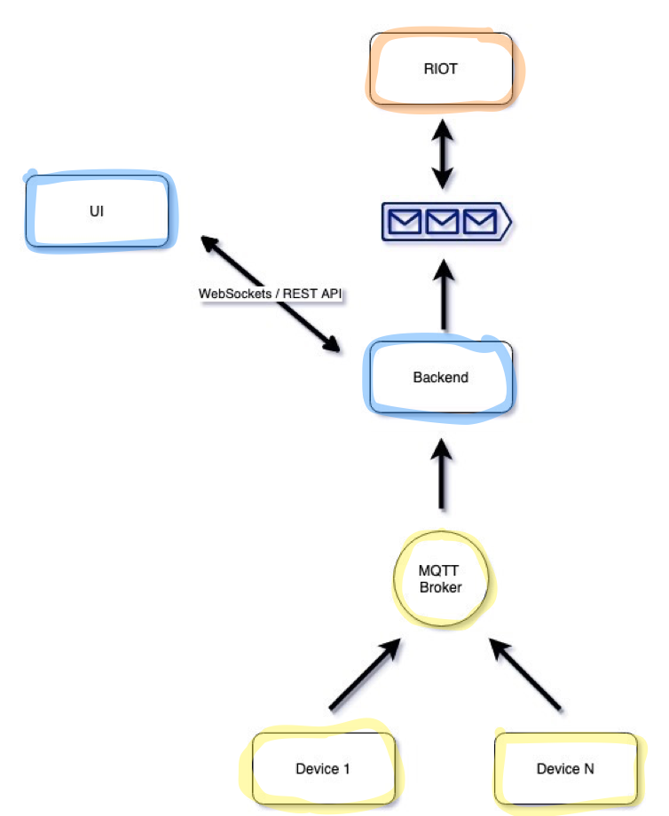

## Backend RIOT

This project is the backend of the RIOT service, responsible for the user interactions within the system.

To be possible to create triggers in real-time without the need of restarting the Real-time Pipeline, the backend service is responsible for this task.

Another core functionality is the ability to retrieve the status of IoT devices in Real-time, from the Streaming Pipeline in order to be possible to dispose the data to a WebApp application to build a Real-Time dashboard.complex as well a better alert manager. 



RIOT project: https://github.com/congd123/realtime-state-iot

## Before steps
In order to put the Backend running in necessary to start the Apache Kafka, that you can up/running using the docker.

The configuration to start the Apache Kafka is in the project [RIOT](https://github.com/congd123/realtime-state-iot), there you will find a docker-compose with the description of the dependency.

## Project Structure

The project was developed using Spring Boot + WebFlux and maven.

## Generate application binary

To generate the application binary you can execute: 
```
mvn clean package
```
in in the folder `/target` will exists the jars generated and you can run the jar itself or integrate the service in your infrastructure as a microservice perhaps orchestrated by Kubernetes.

## Start the service
After accomplish the before steps you are ready to start the Backend service.

Endpoint:

- GET /init/{host}/{port}
    
    Starting point to establish the connection within the Real-Time pipeline
- GET /state/{jobId}/{id}

    Retrieve the state of a given IoT device from a specific job
- POST /state

    Publish the IoT states into the Real-time pipeline. In the future this will be removed and will be handled by other process 

- POST /trigger 

    Generation of triggers, that will be trigger on the Real-time pipeline when the state of each device matches the trigger

## Improvements

- Unit tests still missing due to the lack of time 
- Remove the logic of publishing to other process